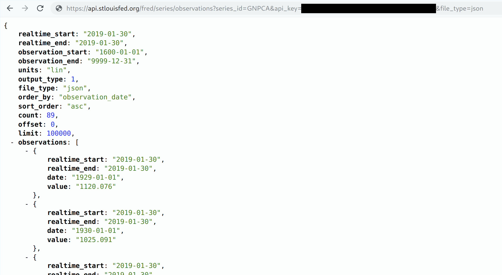

```{r setup, include=FALSE}
knitr::opts_chunk$set(echo = TRUE, cache = TRUE, dpi=300)
```

## Sign-up and software requirements

### Sign-up

We're going to be downloading economic data from the FRED API. This will require that you first [create a user account](https://research.stlouisfed.org/useraccount/apikey) and then [register a personal API key](https://research.stlouisfed.org/useraccount/apikey).

### External software

Today I'll be using [JSONView](https://jsonview.com/), a browser extension that renders JSON output nicely in Chrome and Firefox. (Not required, but recommended.)

### R packages 

- New: **jsonlite**, **httr**, **listviewer**, **usethis**, **fredr**
- Already used: **tidyverse**, **lubridate**, **hrbrthemes**, **janitor**

Here's a convenient way to install (if necessary) and load all of the above packages.

```{r packages, cache=F, message=F}
## Load and install the packages that we'll be using today
if (!require("pacman")) install.packages("pacman")
pacman::p_load(tidyverse, httr, lubridate, hrbrthemes, janitor, jsonlite, fredr, 
               listviewer, usethis)
## My preferred ggplot2 plotting theme (optional)
theme_set(hrbrthemes::theme_ipsum())
```


## Recap from last time

During the last lecture, we saw that websites and web applications fall into two categories: 1) Server-side and 2) Client-side. We then practiced scraping data that falls into the first category --- i.e. rendered server-side --- using the **rvest** package. This technique focuses on CSS selectors (with help from [SelectorGadget](http://selectorgadget.com/)) and HTML tags. We also saw that webscraping often involves as much art as science. The plethora of CSS options and the flexibility of HTML itself means that steps which work perfectly well on one website can easily fail on another website.

Today we focus on the second category: Scraping web data that is rendered **client-side**. The good news is that, when available, this approach typically makes it much easier to scrape data from the web. The downside is that, again, it can involve as much art as it does science. Moreover, as I emphasised last time, just because because we *can* scrape data, doesn't mean that we *should* (i.e. ethical, legal and other considerations). These admonishments aside, let's proceed...

## Client-side, APIs, and API endpoints

Recall that websites or applications that are built using a **client-side** framework typically involve something like the following steps:

- You visit a URL that contains a template of static content (HTML tables, CSS, etc.). This template itself doesn't contain any data.
- However, in the process of opening the URL, your browser sends a *request* to the host server.
- If your request if valid, then the server issues a *response* that fetches the necessary data for you and renders the page dynamically in your browser.
- The page that you actually see in your browser is thus a mix of static content and dynamic information that is rendered by your browser (i.e. the "client").

All of this requesting, responding and rendering takes places through the host application's **API** (or **A**pplication **P**rogram **I**nterface). Time for a student presentation to go over APIs in more depth...

### Student presentation: APIs

If you're new to APIs or reading this after the fact, then I recommend this excellent resource from Zapier: [An Introduction to APIs](https://zapier.com/learn/apis/). It's fairly in-depth, but you don't need to work through the whole thing to get the gist. The summary version is that an API is really just a collection of rules and methods that allow different software applications to interact and share information. This includes not only web servers and browsers, but also software packages like the R libraries we've been using.^[Fun fact: A number of R packages that we'll be using later in this course (e.g. **leaflet**, **plotly**, etc.) are really just a set of wrapper functions that interact with the underlying APIs and convert your R code into some other language (e.g. JavaScript).] Key concepts include:

- **Server:** A powerful computer that runs an API.
- **Client:** A program that exchanges data with a server through an API.
- **Protocol:** The "etiquette" underlying how computers talk to each other (e.g. HTTP).
- **Methods:** The "verbs" that clients use to talk with a server. The main one that we'll be using is `GET` (i.e. ask a server to retrieve information), but other common methods are `POST`, `PUT` and `DELETE`.
- **Requests:** What the client asks of the server (see Methods above).
- **Response:** The server's response. This includes a *Status Code* (e.g. "404" if not found, or "200" if successful), a *Header* (i.e. meta-information about the reponse), and a *Body* (i.e the actual content that we're interested in).
- Etc.

### A bit more about API endpoints

A key point in all of this is that, in the case of web APIs, we can access information *directly* from the API database if we can specify the correct URL(s). These URLs are known as an **API endpoints**. 

API endpoints are in many ways similar to the normal website URLs that we're all used to visiting. For starters, you can navigate to them in your web browser. However, whereas normal websites display information in rich HTML content --- pictures, cat videos, nice formatting, etc. --- an API endpoint is much less visually appealing. Navigate your browser to an API endpoint and you'll just see a load of seemingly unformatted text. In truth, what you're really seeing is (probably) either [JSON](https://en.wikipedia.org/wiki/JSON) (**J**ava**S**cript **O**bject **No**tation) or [XML](https://en.wikipedia.org/wiki/XML) (E**x**tensible **M**arkup **L**anguage). 

You don't need to worry too much about the syntax of JSON and XML. The important thing is that the object in your browser --- that load of seemingly unformatted text --- is actually very precisely structured and formatted. Moreover, it contains valuable information that we can easily read into R (or Python, Julia, etc.) We just need to know the right API endpoint for the data that we want.

Let's practice doing this through a few example applications. I'll start with the simplest case (no API key required, explicit API endpoint) and then work through some more complicated examples. 

## Application 1: Trees of New York City

[NYC Open Data](https://opendata.cityofnewyork.us/) is a pretty amazing initiative. Its mission is to "make the wealth of public data generated by various New York City agencies and other City organizations available for public use". You can get data on everything from arrest data, to the location of wi-fi hotspots, to city job postings, to homeless population counts, to dog licenses, to a directory of toilets in public parks... The list goes on. I highly encourage you to explore in your own time, but we're going to do something "earthy" for this first application: Download a sample of tree data from the [**2015 NYC Street Tree Census**](https://data.cityofnewyork.us/Environment/2015-Street-Tree-Census-Tree-Data/uvpi-gqnh).

I wanted to begin with an example from NYC Open Data, because you don't need to set up an API key in advance.^[Truth be told: To avoid rate limits --- i.e. throttling the number of requests that you can make per hour --- it's best to [sign up](https://data.cityofnewyork.us/profile/app_tokens) for an NYC Open Data app token. We're only going to make one or two requests here, though so we should be fine.] All you need to do is complete the following steps:

- Open the [web page](https://data.cityofnewyork.us/Environment/2015-Street-Tree-Census-Tree-Data/uvpi-gqnh) in your browser (if you haven't already done so). 
- You should immediately see the **API** tab. Click on it. 
- Copy the [API endpoint](https://data.cityofnewyork.us/resource/nwxe-4ae8.json) that appears in the popup box. 
- *Optional:* Paste that endpoint into a new tab in your browser. You'll see a bunch of JSON text, which you can render nicely using the JSONView browser extension that we installed earlier.

Here's a GIF of me completing these steps:

```{r trees_gif, echo = FALSE, out.width='100%'}
if (knitr::is_html_output()){
  knitr::include_graphics('pics/trees.gif')
} else {
  message("Sorry, this GIF is only available in the the HTML version of the notes.")
}
```

Now that we've located the API endpoint, let's read the data into R. We'll do so using the `fromJSON()` function from the excellent **jsonlite** package ([link](https://cran.r-project.org/web/packages/jsonlite/index.html)). This will automatically coerce the JSON array into a regular R data frame. However, I'll go that little bit further and convert it into a tibble, since the output is nicer to work with.

```{r nyc1}
# library(jsonlite) ## Already loaded

nyc_trees = 
  fromJSON("https://data.cityofnewyork.us/resource/nwxe-4ae8.json") %>%
  as_tibble()
nyc_trees
```

**Aside on limits:** Note that the full census dataset contains nearly 700,000 individual trees. However, we only downloaded a tiny sample of that, since the API defaults to a limit of 1,000 rows. I don't care to access the full dataset here, since I just want to illustrate some basic concepts. Nonetheless, if you were so inclined and [read the docs](https://dev.socrata.com/docs/queries/limit.html), you'd see that you can override this default by adding `?$limit=LIMIT` to the API endpoint. For example, to read in only the first five rows, you could use:

```{r nyc2, eval=F}
## Not run
fromJSON("https://data.cityofnewyork.us/resource/nwxe-4ae8.json?$limit=5")
```

Getting back on track, let's plot our tree data just to show it worked. One minor thing I want to point out is that `jsonlite::fromJSON()` automatically coerces everything into a character, so we'll also need to convert some columns to numeric before we plot.

```{r nyc3}
nyc_trees %>% 
  select(longitude, latitude, stump_diam, spc_common, spc_latin, tree_id) %>% 
  mutate_at(vars(longitude:stump_diam), as.numeric) %>% 
  ggplot(aes(x=longitude, y=latitude, size=stump_diam)) + 
  geom_point(alpha=0.5) +
  scale_size_continuous(name = "Stump diameter") +
  labs(
    x = "Longitude", y = "Latitude",
    title = "Sample of New York City trees",
    caption = "Source: NYC Open Data"
    )
```

Not too bad. This would probably be more fun / impressive with an actual map of New York behind it. We'll save that for the spatial lecture that's coming up later in the course, though.

Again, I want to remind you that our  first application didn't require prior registration on the Open Data NYC website, or creation of an API key. This is atypical. Most API interfaces will only let you access and download data after you have registered an API key with them. This is especially true if you want to access an API linked to a federal agency or institution (Census, BEA, etc.). So let's work through an application where an API key is required...

## Application 2: FRED data

Our second application will involve downloading data from the [**FRED API**](https://research.stlouisfed.org/docs/api/fred/). You will need to [register an API key](https://research.stlouisfed.org/useraccount/apikey) if you want to follow along with my steps, so please do so first before continuing. 

As nearly every economist could tell you, [FRED](https://fred.stlouisfed.org/) is a database maintained by the Federal Reserve Bank of St Louis. You know, the one that let's you plot cool interactive charts [like this one](https://fred.stlouisfed.org/series/GNPCA#0) of US GNP since 1929.

<iframe src="https://fred.stlouisfed.org/graph/graph-landing.php?g=yo2J&width=670&height=475" scrolling="no" frameborder="0" style="overflow:hidden; width:670px; height:525px;" allowTransparency="true" loading="lazy"  data-external="1"></iframe>

</br>

```{r fred_iframe, echo = FALSE, out.width='100%'}
if (!knitr::is_html_output()){
  message("Sorry, this interactive chart is only available in the the HTML version of the notes.")
}
```

For this second example application, I'm going to show you how to download the data underlying the above chart using the FRED API. In fact, I'll go one better. First, I'll show you how to download it yourself, so that you get an understanding of what's happening underneath the hood. Then, I'll direct you to a package that does all of the API work for you.

### Do it yourself

As with all APIs, a good place to start is the [FRED API developer docs](https://research.stlouisfed.org/docs/api/fred/). If you read through these, you'd see that the endpoint path we're interested in is [**series/observations**](https://research.stlouisfed.org/docs/api/fred/series_observations.html). This endpoint "gets the observations or data values for an economic data series". The endpoint documentation gives a more in-depth discussion, including the various parameters that it accepts.^[Think of API *parameters* the same way that you think about function *arguments*. They are valid inputs (instructions) that modify the response to an API request.] However, the parameters that we'll be focused on here are simply:

- **file_type:** "json" (Not required, but our preferred type of output.)
- **series_id:** "GNPCA" (Required. The data series that we want.)
- **api_key:** "YOUR_API_KEY" (Required. Go and fetch/copy your key now.)

Let's combine these parameters with the endpoint path to view the data directly in our browser. Head over to [https://api.stlouisfed.org/fred/series/observations?series_id=GNPCA&api_key=<mark>YOUR_API_KEY</mark>&file_type=json](https://api.stlouisfed.org/fred/series/observations?series_id=GNPCA&api_key=YOUR_API_KEY&file_type=json), replacing "YOUR_API_KEY" with your actual key. You should see something like the following:



At this point you're probably tempted to read the JSON object directly into your R environment using the `jsonlite::readJSON()` function. And this will work. However, that's not what we're going to here. Rather, we're going to go through the **httr** package ([link](https://httr.r-lib.org/)). Why? Well, basically because **httr** comes with a variety of features that allow us to interact more flexibly and securely with web APIs. 

Let's start by defining some convenience variables such as the endpoint path and the parameters (which we'll store in a list).

```{r fred1, include=F, cache=F}
endpoint = "series/observations"
params = list(
  api_key = Sys.getenv("FRED_API_KEY"),
  file_type="json", 
  series_id="GNPCA"
  )
```
```{r fred1_false, eval=FALSE}
endpoint = "series/observations"
params = list(
  api_key= "YOUR_FRED_KEY", ## Change to your own key
  file_type="json", 
  series_id="GNPCA"
  )
```

Next, we'll use the `httr::GET()` function to request (i.e. download) the data. I'll assign this to an object called `fred`.

```{r fred2, cache=F}
# library(httr) ## Already loaded above

fred = 
  httr::GET(
    url = "https://api.stlouisfed.org/", ## Base URL
    path = paste0("fred/", endpoint),    ## The API endpoint
    query = params                       ## Our parameter list
    )
```

Take a second to print the `fred` object in your console. What you'll see is pretty cool; i.e. it's the actual API response, including the *Status Code* and *Content*. Something like:

```
## Response [https://api.stlouisfed.org/fred/series/observations?api_key=YOUR_API_KEY&file_type=json&series_id=GNPCA]
##   Date: 2019-02-01 00:06
##   Status: 200
##   Content-Type: application/json; charset=UTF-8
##   Size: 9.09 kB
```

To actually extract the content (i.e. data) from of this response, I'll use the `httr::content()` function. Moreover, since we know that this content is a JSON array, we can again convert it into an R object using `jsonlite::fromJSON()`.

```{r fred3, cache=F, out.width="100%", out.height="10%"}
fred = 
  fred %>% 
  httr::content("text") %>% ## Extract the reponse content (i.e. text)
  jsonlite::fromJSON()      ## Convert from JSON to R object

## What type of object did we get?
typeof(fred)
```

It turns that the previous step has yielded a list object in R.^[complex nested lists are the law of the land when it comes to json information. don't worry too much about this now; just rest assured that r is well suited to handling these kinds of objects. it's one reason why r and json play so well together. we'll see more examples later in the course when we start working with programming and spatial data.] so now we need to inspect this list to better understand its structure before  extracting the information that we care about (and coerce it to a data frame.) I'd use the base `View()` function to do this in an interactive r session. but that won't work as well for these lecture notes. Instead, I'll use the `listviewer::jsonedit()` function to create an interactive widget that renders nicely in knitted r markdown documents.

```{r fred3b, cache=F, out.width="100%", out.height="10%"}
# View(fred) ## What I'd use in an interactive R session

## library(listviewer)        ## Already loaded
jsonedit(fred, mode = "view") ## Better for RMarkdown documents
```

Luckily, this particular list object isn't too complicated. We can see that what we're really interested in, is the `fred$observations` sub-element. I'll use `purrr::pluck()` to extract this element (there are various other ways to do this) and then coerce it to a tibble.

```{r fred4, cache=F}
fred =
  fred %>% 
  purrr::pluck("observations") %>% ## Extract the "$observations" list element
  # .$observations %>% ## I could also have used this
  # magrittr::extract("observations") %>% ## Or this
  as_tibble() ## Just for nice formatting
fred
```

Okay! We've finally got our data and are nearly ready for some plotting. Recall that `jsonlite::fromJSON()` automatically converts everything to characters, so I'll quickly change some variables to dates (using `lubridate::ymd()`) and numeric.

```{r fred5, message=F}
# library(lubridate) ## Already loaded above

fred =
  fred %>%
  mutate(across(realtime_start:date, ymd)) %>%
  mutate(value = as.numeric(value)) 
```

Let's plot this sucker.

```{r fred6}
fred %>%
  ggplot(aes(date, value)) +
  geom_line() +
  scale_y_continuous(labels = scales::comma) +
  labs(
    x="Date", y="2012 USD (Billions)",
    title="US Real Gross National Product", caption="Source: FRED"
    )
```


### Aside: Safely store and use API keys as environment variables

In the above example, I assumed that you would just replace the "YOUR_FRED_KEY" holder text with your actual API key. This is obviously not very secure or scalable, since it means that you can't share your R script without giving away your key.^[The same is true for compiled R Markdown documents like these lecture notes.] Luckily, there's an easy way to safely store and use sensitive information like API keys or passwords: Simply save them as an R [**environment variables**](https://stat.ethz.ch/R-manual/R-devel/library/base/html/EnvVar.html). There are two, closely related approaches:

1. Set an environment variable for the current R session only.
2. Set an environment variable that persists across R sessions.

Let's briefly review each in turn.

#### 1) Set an environment variable for the current R session only

Defining an environment variable for the current R session is very straightforward. Simply use the base `Sys.setenv()` function. For example:

```{r set_renviron_current}
## Set new environment variable called MY_API_KEY. Current session only.
Sys.setenv(MY_API_KEY="abcdefghijklmnopqrstuvwxyz0123456789") 
```

Once this is done, you can then safely assign your key to an object --- including within an R Markdown document that you're going to knit and share --- using the `Sys.getenv()` function. For example:

```{r get_renviron_current}
## Assign the environment variable to an R object
my_api_key = Sys.getenv("MY_API_KEY")
## Print it out just to show that it worked
my_api_key
```

**Important:** While this approach is very simple, note that in practice the `Sys.setenv()` part should only be run directly in your R console. *Never* include code chunks with sensitive `Sys.setenv()` calls in an R Markdown file or other shared documents.^[Since the new R environment variable is defined for the duration of the current session, R Markdown will have access to this variable irrespective of whether it was defined in the R Markdown script or not.] That would entirely defeat the purpose! Apart from the annoyance of having to manually set my API key each time I start a new R session, this is one reason that I prefer the next approach of persisting environment variables across sessions...

#### 2) Set an environment variable that persist across R sessions

The trick to setting an R environment variable that is available across sessions is to add it to a special file called `~/.Renviron`. This is a text file that lives on your home directory --- note the `~/` path --- which R automatically reads upon startup. Because `~/.Renviron` is just a text file, you can edit it with whatever is your preferred text editor. However, you may need to create it first if it doesn't exist. A convenient way to do all of this from RStudio is with the `usethis::edit_r_environ()` function. You will need to run the next few lines interactively:

```{r edit_r_environ, eval = F}
## Open your .Renviron file. Here we can add API keys that persist across R sessions.
usethis::edit_r_environ() 
```

This will open up your `~/.Renviron` file in a new RStudio window, which you can then modify as needed. As an example, let's say that you want to add your FRED API key as an environment variable that persists across sessions. You can do this by simply adding a line like the below to your `~/.Renviron` file and saving.^[I suggest calling it something that's easy to remember like "FRED_API_KEY", but as you wish.]

```
FRED_API_KEY="abcdefghijklmnopqrstuvwxyz0123456789" ## Replace with your actual key
```

Once you have saved your changes, you'll need to refresh so that this new environment variable is available in the current session. You could also restart R, but that's overkill.

```{r readRenviron, eval = F}
## Optional: Refresh your .Renviron file.  
readRenviron("~/.Renviron") ## Only necessary if you are reading in a newly added R environment variable
```

**Challenge:** Once you've refreshed your `~/.Renviron` file, try to re-download the FRED data from earlier. This time call your FRED API key directly as an environment variable in your parameter list using `Sys.getenv()` like this:

```{r params_challenge, eval=F}
params = list(
  api_key= Sys.getenv("FRED_API_KEY"), ## Get API directly and safely from the stored environment variable
  file_type="json", 
  series_id="GNPCA"
  )
```

We're going to be revisiting (and setting) environment variables once we get to the cloud computation part of the course. So please make sure that you've understood this section and that your new FRED API key works.

### Use a package

One of the great features about the R (and data science community in general) is that someone has probably written a package that does all the heavy API lifting for you. We'll come across many examples during the remainder of this course, but for the moment I want to flag the **fredr** package ([link](http://sboysel.github.io/fredr/index.html)). Take a look at the "Get started" page to see how you could access the same GDP data as above, but this time going through a package.


## Summary

- An API is a set of rules and methods that allow one computer or program (e.g. host server) to talk to another (e.g. client or browser).
- We can access information through an API directly by specifying a valid API endpoint.
  - The API endpoint for most web-based applications will be a URL with either JSON or XML content.
- Some APIs don't require an access key or token, but most do. You can add this key as a parameter to the API endpoint.
- Downloading content from an API endpoint to our local computer (i.e. R environment) can be done in a variety of ways.
   - E.g. `jsonlite::readJSON()` to read the the JSON array directly, or `httr::GET()` to download the entire response, or installing a package that does the job for us.
- **Next lecture:** Regression analysis in R. (The start of the analysis and programming section of the course.)


## Further resources and exercises

- [Here](https://www.pscp.tv/w/1ynKOpVnERrGR) is a short, live video stream that I did for scraping traffic fatality data from [LA's Open Data portal](https://data.lacity.org/). As I mention in the video, this covers very similar ground to today's lecture. But I do expand a bit on using API parameters to query (i.e. wrangle and summarise) data directly up on the host server before scraping it.

- [Tyler Clavelle](https://twitter.com/tclavl) has written several cool [blog posts](https://tclavelle.github.io/blog/) on interacting with APIs through R. I especially recommend going over --- and replicating --- his excellent [tutorial on the GitHub API](https://tclavelle.github.io/blog/r_and_apis/). 

- Jonathan Regenstein has a nice post on RStudio's *R Views* blog, "[GDP Data via API](https://rviews.rstudio.com/2018/09/12/gdp-via-api/)", which treads a similar path to my FRED example. Except he uses the Bureau of Economic Analysis (BEA) API.

- Greg Reda's "[Web Scraping 201: finding the API](http://www.gregreda.com/2015/02/15/web-scraping-finding-the-api/)" covers much of the same ground as we have here. While he focuses on Python tools, I've found it to be a handy reference over the years. (You can also take a look at the earlier posts in Greg's webscraping series --- [Part 1](http://www.gregreda.com/2013/03/03/web-scraping-101-with-python/) and [Part 2](http://www.gregreda.com/2013/04/29/more-web-scraping-with-python/) --- to see some Python equivalents of the `rvest` tools that we've been using.) 

- Ian London (another Python user) has a nice blog post on "[Discovering hidden APIs](https://ianlondon.github.io/blog/web-scraping-discovering-hidden-apis/)" from Airbnb.

- Finally, while the methods covered in the last two lectures should have you covered for 95% (99%?) of your webscraping needs, there are some corner cases where they won't work. In particular, you may run into cases where website content is rendered dynamically with JavaScript. In times like these, you'll need to spin up a so-called "headless" browser to extract the content. More [here](https://rud.is/b/2017/02/09/diving-into-dynamic-website-content-with-splashr/) and [here](https://twitter.com/grant_mcdermott/status/1192889722672041984).
